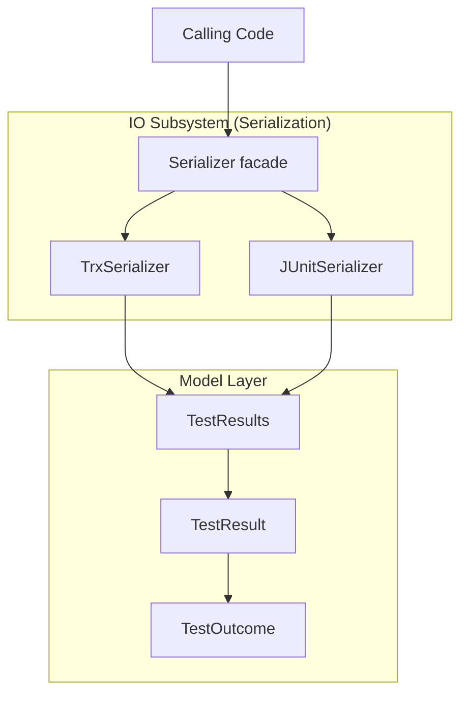

# System Design

## Overview

The TestResults library is a .NET library for reading and writing test result
files in multiple formats. It provides a format-agnostic in-memory model and
format-specific serialization implementations.

## System Architecture

The TestResults library uses a layered architecture:



## Software Items

The TestResults system contains the following software items:

```text
TestResults Library (System)
├── IO (Subsystem)
│   ├── Serializer (Unit)
│   ├── TrxSerializer (Unit)
│   └── JUnitSerializer (Unit)
├── TestOutcome (Unit)
├── TestResult (Unit)
└── TestResults (Unit)
```

## External Interfaces

The TestResults library exposes the following public API entry points:

- `Serializer.Identify(string)`: Detects format of a test result file
- `Serializer.Deserialize(string)`: Reads a test result file into the model
- `TrxSerializer.Serialize(TestResults)`: Writes TRX format
- `TrxSerializer.Deserialize(string)`: Reads TRX format
- `JUnitSerializer.Serialize(TestResults)`: Writes JUnit XML format
- `JUnitSerializer.Deserialize(string)`: Reads JUnit XML format

## Supported Formats

| Format | Description | Standard |
| ------ | ----------- | -------- |
| TRX | Visual Studio Test Results | Microsoft proprietary |
| JUnit XML | JUnit test results | Apache JUnit |

## Related Requirements

System-level requirements are in [docs/reqstream/system.yaml](../reqstream/system.yaml).
Platform requirements are in
[docs/reqstream/platform-requirements.yaml](../reqstream/platform-requirements.yaml).
