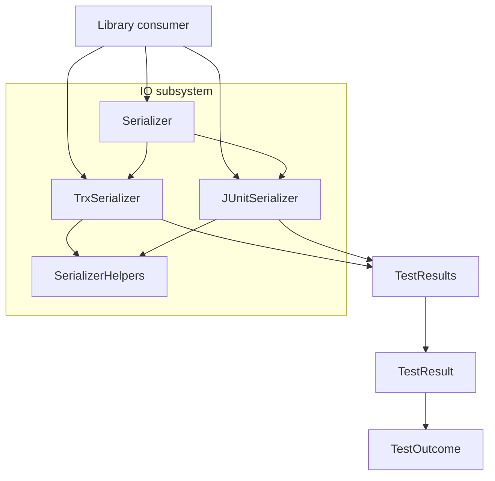

# TestResultsLibrary

## Architecture

TestResultsLibrary uses a format-neutral in-memory model as the center of the design.
`TestOutcome` classifies individual executions, `TestResult` captures one execution record,
and `TestResults` groups a complete run. The IO subsystem translates that model to and from
TRX and JUnit XML. `Serializer` provides format identification and delegated
deserialization, while `TrxSerializer` and `JUnitSerializer` perform format-specific
translation and share `Utf8StringWriter` through `SerializerHelpers` so both outputs declare
UTF-8 correctly.

## External Interfaces

**In-process .NET API**: Public model and serializer types exposed by the library.

- *Type*: In-process .NET public API.
- *Role*: Provider.
- *Contract*: `TestResults`, `TestResult`, `TestOutcome`, `Serializer`, `TrxSerializer`,
  and `JUnitSerializer` exchange test results as C# objects and XML strings.
- *Constraints*: Callers supply XML content as strings. `Serializer.Deserialize()` rejects
  null, whitespace, and unknown formats. Format-specific serializers reject null inputs.

**TRX XML input**: Microsoft TRX documents consumed by the library.

- *Type*: XML document interface.
- *Role*: Consumer.
- *Contract*: `Serializer` and `TrxSerializer` accept `TestRun` documents in the
  `http://microsoft.com/schemas/VisualStudio/TeamTest/2010` namespace.
- *Constraints*: `TrxSerializer.Deserialize()` requires structurally valid cross-references
  between `UnitTestResult` and `UnitTest` elements.

**TRX XML output**: TRX documents produced from the in-memory model.

- *Type*: XML document interface.
- *Role*: Provider.
- *Contract*: `TrxSerializer.Serialize()` emits `TestRun`, `Results`, `TestDefinitions`,
  `TestEntries`, `TestLists`, and `ResultSummary` sections.
- *Constraints*: Output always declares UTF-8 and uses the standard unit test type GUID and
  the standard `All Loaded Results` test list.

**JUnit XML input**: JUnit result documents consumed by the library.

- *Type*: XML document interface.
- *Role*: Consumer.
- *Contract*: `Serializer` and `JUnitSerializer` accept `testsuites` or `testsuite` roots
  and map child `testcase` elements to `TestResult` instances.
- *Constraints*: Missing or malformed durations and timestamps degrade to safe defaults
  instead of aborting deserialization.

**JUnit XML output**: JUnit result documents produced from the in-memory model.

- *Type*: XML document interface.
- *Role*: Provider.
- *Contract*: `JUnitSerializer.Serialize()` emits a `testsuites` root containing one
  `testsuite` per class name and one `testcase` per result.
- *Constraints*: Empty class names are serialized with the sentinel suite name
  `DefaultSuite`, and output always declares UTF-8.

## Dependencies

N/A - the system relies only on the .NET runtime and base class library APIs such as LINQ to
XML, XPath, culture-aware formatting, and text encoding. No separately documented OTS or
shared package design files are modeled in this design collection.

## Risk Control Measures

N/A - not a safety-classified software item.

## Data Flow

1. A library consumer creates a `TestResults` model or supplies XML content to deserialize.
2. `Serializer.Identify()` inspects the XML root element to distinguish TRX from JUnit.
3. `TrxSerializer` or `JUnitSerializer` converts between external XML and the shared
   `TestResults`/`TestResult`/`TestOutcome` model.
4. `SerializerHelpers` supplies `Utf8StringWriter` so XML serializers emit a UTF-8
   declaration in the XML prolog.
5. The caller either consumes the populated model or forwards the serialized XML to another
   tool in the test-results workflow.

## Design Constraints

- Platform: the implementation is an in-process C#/.NET library with no built-in file,
  network, or database transport layer.
- Format neutrality: the model units store test semantics, not TRX-specific or
  JUnit-specific XML nodes, so conversion stays isolated in the IO subsystem.
- XML compatibility: TRX detection requires the exact TRX namespace and `TestRun` root,
  while JUnit detection accepts either `testsuites` or `testsuite` roots.
- Encoding: serialized XML must declare UTF-8 because downstream tools consume the returned
  strings as XML documents.
- Fidelity: TRX round-trips preserve all modeled data, while JUnit preserves core data but
  maps `Timeout` and `Aborted` back to `Error` and uses `DefaultSuite` as the empty-class
  sentinel.
