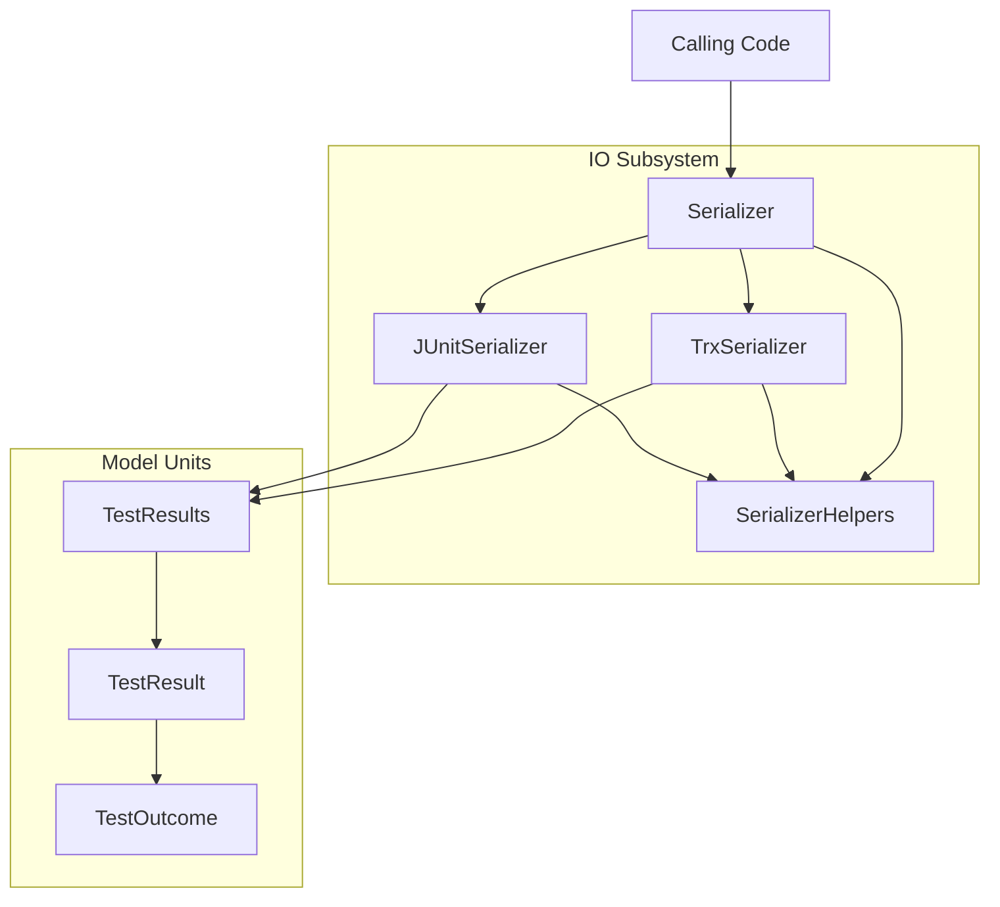

# TestResults Library System Design

## Overview

The TestResults Library is a .NET library for reading and writing test result
files in multiple formats. It provides a format-agnostic in-memory model and
format-specific serialization implementations.

## System Architecture

The TestResults Library uses a layered architecture:

## Subsystems and Units

The TestResults Library contains one subsystem and three top-level units:

### IO Subsystem

The [IO subsystem](io/io.md) handles reading and writing test result files. It comprises
four units:

| Unit | Design | Description |
| ---- | ------ | ----------- |
| [Serializer](io/serializer.md) | `io/serializer.md` | Format-detection facade |
| [SerializerHelpers](io/serializer-helpers.md) | `io/serializer-helpers.md` | Internal UTF-8 writer helper |
| [TrxSerializer](io/trx-serializer.md) | `io/trx-serializer.md` | TRX format read/write |
| [JUnitSerializer](io/junit-serializer.md) | `io/junit-serializer.md` | JUnit XML format read/write |

### Top-Level Units

The three model units are outside any subsystem:

| Unit | Design | Description |
| ---- | ------ | ----------- |
| [TestOutcome](test-outcome.md) | `test-outcome.md` | Enumeration of possible test outcomes |
| [TestResult](test-result.md) | `test-result.md` | Single test execution result |
| [TestResults](test-results.md) | `test-results.md` | Named collection of test results |

## External Interfaces

The TestResults Library exposes the following public API entry points:

- `Serializer.Identify(string)`: Detects format of a test result file
- `Serializer.Deserialize(string)`: Reads a test result file into the model
- `TrxSerializer.Serialize(TestResults)`: Writes TRX format
- `TrxSerializer.Deserialize(string)`: Reads TRX format
- `JUnitSerializer.Serialize(TestResults)`: Writes JUnit XML format
- `JUnitSerializer.Deserialize(string)`: Reads JUnit XML format

## Supported Formats

| Format | Description | Standard |
| ------ | ----------- | -------- |
| TRX | Visual Studio Test Results | Microsoft proprietary |
| JUnit XML | JUnit test results | Apache JUnit |

## Related Requirements

System-level requirements are in
[docs/reqstream/test-results-library/test-results-library.yaml](../../reqstream/test-results-library/test-results-library.yaml).
Platform requirements are in
[docs/reqstream/test-results-library/platform-requirements.yaml](../../reqstream/test-results-library/platform-requirements.yaml).
