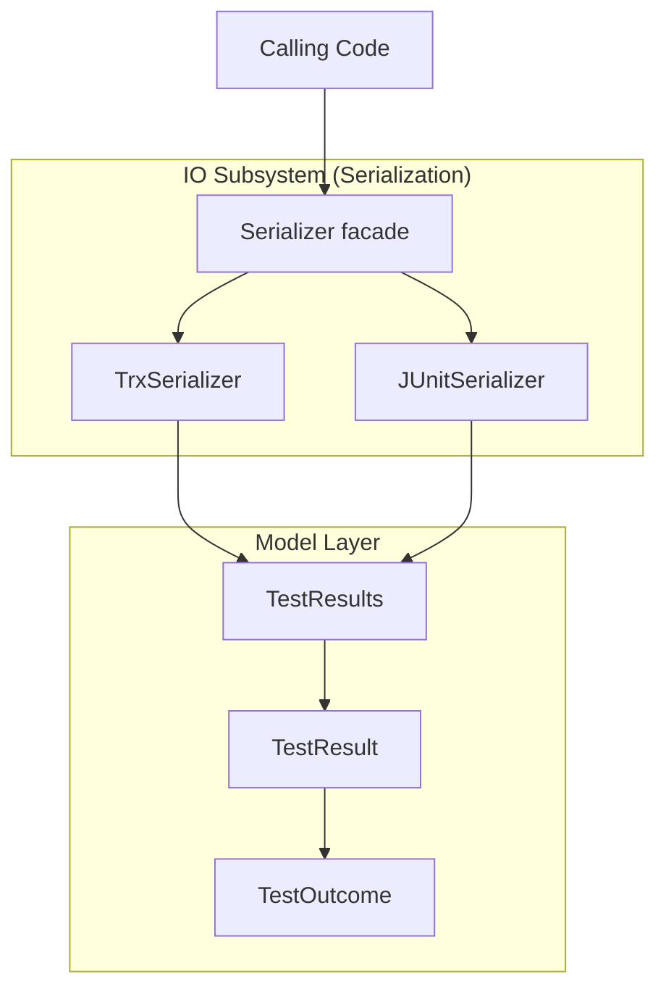

# TestResults System Design

## Overview

The TestResults library is a .NET library for reading and writing test result
files in multiple formats. It provides a format-agnostic in-memory model and
format-specific serialization implementations.

## System Architecture

The TestResults library uses a layered architecture:

## Software Items

The software items in the TestResults system are described in the
[introduction](../introduction.md#software-structure).

## External Interfaces

The TestResults library exposes the following public API entry points:

- `Serializer.Identify(string)`: Detects format of a test result file
- `Serializer.Deserialize(string)`: Reads a test result file into the model
- `TrxSerializer.Serialize(TestResults)`: Writes TRX format
- `TrxSerializer.Deserialize(string)`: Reads TRX format
- `JUnitSerializer.Serialize(TestResults)`: Writes JUnit XML format
- `JUnitSerializer.Deserialize(string)`: Reads JUnit XML format

## Supported Formats

| Format | Description | Standard |
| ------ | ----------- | -------- |
| TRX | Visual Studio Test Results | Microsoft proprietary |
| JUnit XML | JUnit test results | Apache JUnit |

## Related Requirements

System-level requirements are in
[docs/reqstream/test-results/test-results.yaml](../../reqstream/test-results/test-results.yaml).
Platform requirements are in
[docs/reqstream/test-results/platform-requirements.yaml](../../reqstream/test-results/platform-requirements.yaml).

## TestResults Class

The `TestResults` class represents a complete test run — a named collection of
`TestResult` objects along with run-level metadata.

### Properties

| Property   | Type                | Default          | Description                            |
|------------|---------------------|------------------|----------------------------------------|
| `Id`       | `Guid`              | `Guid.NewGuid()` | Uniquely identifies this test run      |
| `Name`     | `string`            | `string.Empty`   | Display name of the test run           |
| `UserName` | `string`            | `string.Empty`   | User or identity that initiated the run|
| `Results`  | `List<TestResult>`  | `[]`             | Ordered collection of test case results|

`Id` is auto-generated on construction for the same reasons as `TestResult.TestId` — it
ensures every run is uniquely identifiable in TRX output without requiring callers to
supply an identifier.

`Results` is initialized to an empty list, so callers can simply add items without
first checking for null.
